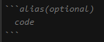

# How-to-Present-Coding-Problem-in-Discord

## Code Block

format:  

for example, jsx code  

list of alias can be found here:   
https://highlightjs.readthedocs.io/en/latest/css-classes-reference.html#language-names-and-aliases
