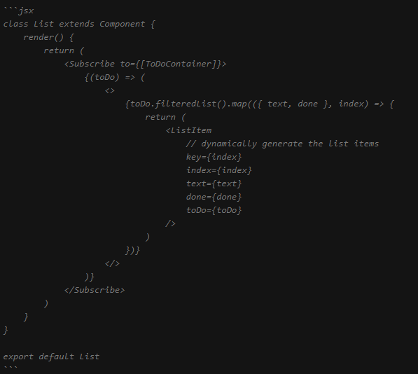

# Discord-Help-My-Please-101

Become the Master of code pasting and code screen shoot in Discord.

Present your problem clearly to reduce both you and your helpers blood pressure.

Getting help is hard, don't make it harder for your helpers!

Be smart in coding, be smart in asking for help!

For Odin's sake, be smart!

## Install Discord on Your PC

No excuses, do it now!
https://discordapp.com/

## Identify and Filter

Do not paste all your code, instead filter and identify which part of code has problem.

Pasting all the code greatly reduce your chance to get help because too much distraction.

It also show that you never put in any effort trying to solve the question on your own and just want to rely on the community.

People like to help you if you help yourself first.

If the issue is very complicated and consist of many modules, paste the link to your repository instead.

## Code Block

format:  

for example, jsx code  

it is displayed as  

list of alias can be found here:   
https://highlightjs.readthedocs.io/en/latest/css-classes-reference.html#language-names-and-aliases

## Print Screen

Do not take picture of your code using phone, it is a real pain!

Is your image clear to yourself? If you are having hard time to see your own photo, why should us?

It ain't fun, it is awful, and you should feel bad about yourself for making this life mistake!

You are on a computer, use the tools provided, don't be lazy, repent your sin!

Window comes with default Snipping Tool, here is some alternative:  
https://www.cnet.com/how-to/7-ways-to-take-screenshots-in-windows-10/

During print screen, make sure it is not too small and can be viewed clearly without `open original`  

If you have a lot of print screen, paste your github repo link instead!

Do not include irrelevant area(like terminal) because it increase the size of your image and big image looks small!

## Formatter

Use formatter like Prettier before you paste your spagetti code

Install Prettier extension for your code editor

## Cunningham's Law

Utilize this simple trick to bait more answers!

https://meta.wikimedia.org/wiki/Cunningham%27s_Law

