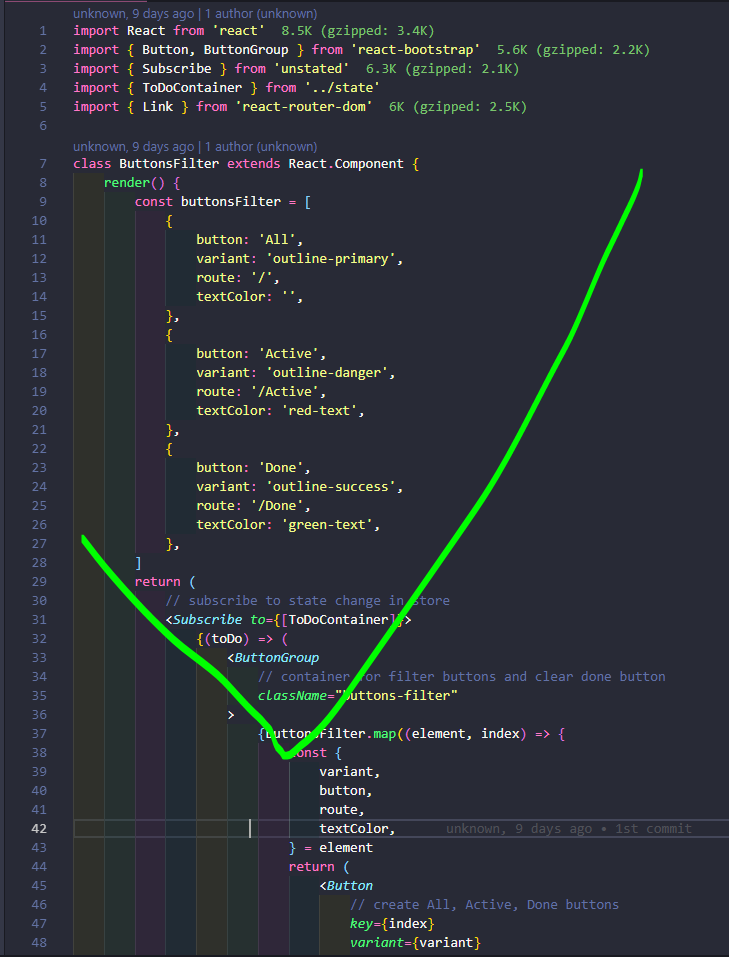

# Discord-Paste-My-Code-101

Become the Master of code pasting and code screen shoot in Discord.

Present your problem clearly reduce both of you and helper blood pressure.

For the sake of Odin!

## Formatter

Use formatter like Prettier before you paste your spagetti code

Install Prettier extension for your code editor

## Code Block

format:  

for example, jsx code  

it is displayed as  

list of alias can be found here:   
https://highlightjs.readthedocs.io/en/latest/css-classes-reference.html#language-names-and-aliases

## Screen Shoot

Window come with default Snipping Tool, here is some alternative:  
https://www.cnet.com/how-to/7-ways-to-take-screenshots-in-windows-10/

During screen shoot, make sure it is not too small and can be viewed clearly without `open original`  
If you have a lot of screen shoot, paste it seperately.  

